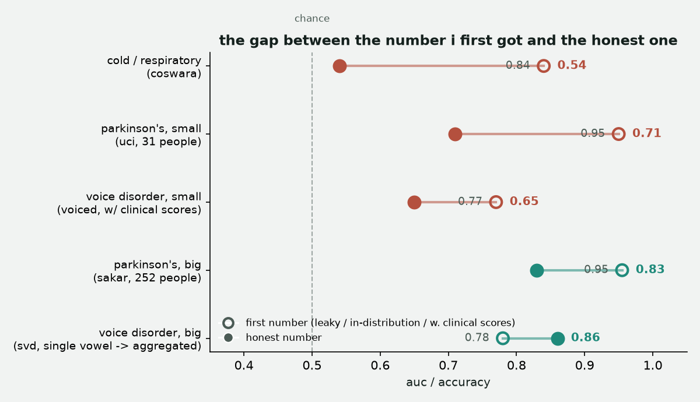

## what i made
a system that tests whether ai can actually detect disease from your voice, honestly. turns out no for a cold (0.54 auc, doesn't generalize), but yes for parkinson's (0.83) and voice disorders (0.86), once you split patients properly and test on data the model's never seen.

## what was challenging
catching my own model cheating. it hit 84% on "sick or not" and looked great until i trained a model on zero audio, just age/sex/date, and it matched the same accuracy. had to prove it wasn't real by testing cross-dataset, which dropped it to a coin flip.

## what i'm proud of
not deleting the failures. the repo shows the cold-detection model failing right next to the parkinson's model working, with receipts for both, instead of just posting the good number.

## what to test
grab the trained model from `parkinsons-sakar/` or `voice-disorder-svd/`, run `predict.py` on a feature file or audio clip, and check it against the numbers in the readme. everything's reproducible from the pipeline scripts, no hidden steps.

## the gap, in one chart
every experiment's first number vs the honest number, side by side. red ones never recovered, teal ones held up once evaluated properly.

